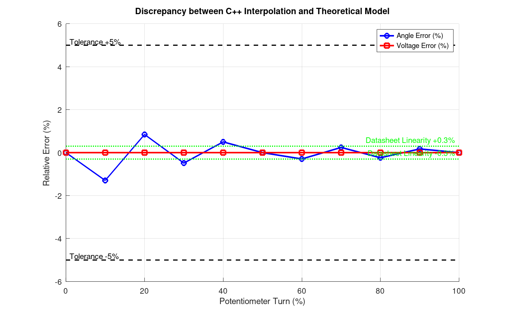

> **Why this Skeleton?**
> In traditional embedded development, there is often  a **"Valley of Death"** between hardware design and software implementation. While hardware engineers provide datasheets and LTSpice models, software engineers write C code based on idealised assumptions. Consequently, the system often fails due to jitter, noise or thermal drift.

>This **skeleton** is designed to bridge the gap by providing a structured workflow for modelling, simulation, and validation. Your can use it as a template. This is a version 0.3.0, which will be improved in the future.


# LIGHT-MBSE-PIPELINE-SKELETON 

> For example we could be used to automate the modeling and validation of a potentiometer.

1. **Methodology & Approach:**
- LIGHT-MBSE-PIPELINE-SKELETON is designed to provide a roadmap for modelling and validating a component, such as a potentiometer.
2. **Setup:** 
- Datasheets Potentiometer `references/Potentiometer-Properties.csv` and `references/Potentiometer-Data.csv`.

## Iteration Roadmap and publishing plan

| Version | Status | Pipeline Engine | Focus |
| ------- | ------ | --------------- | ----- |
| Research | Closed | SKELETON v.0.1.0 | Description of initial finding |
| Base Version | Closed | SKELETON v.0.2.0 | Initial version formatting |
| Worked Example | Current | SKELETON v.0.3.0 | Addition of Feature |


## Table of Contents

- [Iteration Roadmap](#iteration-roadmap)
- [Table of Contents](#table-of-contents)
- [Motivation](#motivation)
- [Environment & Toolchain (Reproducibility)](#environment--toolchain-reproducibility)
- [Project Documentation](#project-documentation)
- [Project Directory Structure](#project-directory-structure)
- [LTSpice Workflow](#ltspice-workflow)
- [Octave Workflow](#octave-workflow)
- [Code Workflow](#code-workflow)
- [Renode Workflow](#renode-workflow)
- [Build & Test](#build--test)
- [Validation Workflow, Results](#validation-workflow-results)
- [Known Problems and Limitations](#known-problems-and-limitations)
- [References](#references)
- [License](#license)

## Motivation

I created a C++ motor model using stand test data. The model works — in the hover-cruise range (20–60% throttle), the average error is 5.5% for thrust, 3.8% for current. However, I had no way to reproducing the result from scratch in a reasonable amount time. If I lost the intermediate files, where would be no way to knowing where anything came from. If I changed the motor, everything would need to be redone manually.
The idea was simple: **every artefact should be automatically generated from a single source of truth.**
I redesigned the structure and implemented it as a `LIGHT-MBSE-PIPELINE-SKELETON` - a lightweight, reproducible pipeline for embedded modelling. It's not a complete toolchain or code, it's just  text, but it's structured as workflow. The idea is to provide a roadmap to automating the entire process from raw data to validated model, ensuring that every artefact is traceable and reproducible.


## Environment & Toolchain (Reproducibility)

**Used System:** macOS Tahoe 26.4.1 on Apple Silicon
The following tools can be used to reproduce the scripts and tests in this project.

| Tool | Version | Purpose |
| ------ | --------- | --------- |
| **GNU Octave** | 11.1.0 | mathematical modelling, generation a look-up tables (LUT), reports |
| **Clang** | 21.0.0 | runtime model implementation (POSIX) |
| **arm-none-eabi-gcc**| 15.2.rel1 | bare-metal target compilation (STM32) |
| **Renode** | 1.16.1.16858 | instruction-accurate hardware emulation |
| **CMake** | 4.3.1 | build system management |
| **Bash** | 5.3.9 | pipeline scripting and orchestration |


## Project Documentation

| File | Description |
|------|-------------|
| [FULL SPECIFICATION](./SPEC.md) | component specifications, raw stand test data |
| [CALCULATION DETAILS](./CALC.md) | model derivation: math, pipeline, voltage scaling |
| [VALIDATION REPORT](./VALIDATION.md) | validation results and performance metrics |
| [METRICS.md](./METRICS.md) | units and measurement standards |
| [README.md](./README.md) | project overview, workflow, and documentation structure |

## Pipeline Overview

```text
              new Iteration
        ┌──────────┴────────────┐
        ▼                       ▼
┌────────────────┐    ┌───────────────────┐
│    LTSpice.    │    │    Datasheets     │
│1. Shema        │    │1. Table Data      │
│2. Conditions   │    │2. Raw Data        │
│3. Restrictions │    │3. Specifications  │
└───────┬────────┘    └─────────┬─────────┘
        │                       │
        ▼                       ▼
┌─────────────────────────────────────────┐
│        Octave Mathematical Model.       │
│1. Approximation of Curves               │
│2. Algorithm Logic and model design      │
│3. Export LUT/Dump Generation            │
└───────────────────┬─────────────────────┘
                    │
                    ▼
┌─────────────────────────────────────────┐
│         C/C++ Model Design              │
│1. Import LUT/Dump                       │
│2. Implement Algorithm Logic             │
│3. Optimize for Bare-Metal               │    
│4. Prepare Test Cases                    │
└───────────────────┬─────────────────────┘
                    │
                    ▼
┌─────────────────────────────────────────┐
│         Renode Model Testing            │
│1. Set up Test Bench and add Dump        │
│2. Run Simulations                       │
│3. Export Logs/Dump                      │
└───────────────────┬─────────────────────┘
                    │
                    ▼
┌─────────────────────────────────────────┐
│         Results Analysis                │
│1. Compare with Datasheet and Stand Test │
│2. Analyze Deviations and Errors         │
│3. Prepare Validation Report             │
│4. Prepare Publications LATEX, Markdown  │
└───────────────────┬─────────────────────┘
                    │
                    ▼
            End of Iteration

```

## Project Directory Structure

```text
├── README.md 
├── CALC.md
├── SPEC.md
├── VALIDATION.md
├── METRICS.md
├── LICENSE
├── ltspice/ /* muffler */
├── octave/ /* Octave scripts for calculations */
├── references/ /* Reference materials, datasheets, papers */
├── src/ /* Source code */  
├── tests/ /* Test cases and validation scripts */
├── build(build_stm32)/ /* Build artifacts */
├── renode/ /* Renode simulation environment */
├── docs/ /* Documentation */
├── logs/ /* Logs */
├── assets/ /* Assets */
```


## LTSpice Workflow
> We don't have LTSpice models now, but we will add them in the future.
- Schema and simulation setup in LTSpices.
- Components and parameters.
- Roadmap for starting simulations and extracting data.

## Octave Workflow
> See all details in `CALC.md`
- Workflow in Octave/Mathcad. 
- Calculations to generate the LUT or building the mathematical model.
- Export the data as a LUT or Dump to be used in the C-code and Renode.

## Code Workflow

1. **Import LUT:** Include `src/includes/sensor_lut.h` in `src/core/sensor.cpp`
2. **Implement Algorithm:** in `src/core/sensor.cpp` both for POSIX and STM32 platforms

## Renode Workflow

1. **Set up Environment:** `renode/test_run.resc` — define the test bench, load the model firmware, set up peripherals
2. **Logs:** `./start.sh` — execute the renode command with logs parameters
3. **Logs Output:** `./logs`

## Building

1. **Build:** `./start.sh` — fully pipeline automation: builds the model firmware, runs Renode tests, exports logs, and generates validation reports.
2. **Test:** `./start.sh` — executes the Renode test bench, POSIX unit tests, and generates validation reports.
3. **Test's Reports:**  in `./logs` as `logs/sensor_test_posix.log` and `logs/sensor_test_stm32.log`

**Robust Orchestration:**
> The pipeline is driven by a fail-safe bash orchestrator (start.sh with strict set -euo pipefail). It automatically handles:
- Toolchain dependency checks
- Generation and verification of intermediate artifacts (LUT headers)
- Cross-platform builds (POSIX vs STM32) using CMake
- Asynchronous execution and UART log extraction from Renode
- On-the-fly parsing of validation traces into CSV formats


## Validation Workflow, preparing results, describing the results.

> See all details in `VALIDATION.md`

```text
[VERIFIED]| ### Potentiometer Sensor Tests
[VERIFIED]| - PASS boundaries: 0 ADC -> 0 deg, 4096 ADC -> 355.0 deg
[VERIFIED]| - PASS clamping: Out-of-bounds ADC handled correctly
[VERIFIED]| - PASS midpoint: 2048 ADC -> 177.50 deg
[VERIFIED]| - PASS monotonicity: Angle strictly increases with ADC
[VERIFIED]| - PASS voltage: 2048 ADC -> 2.50V (V_REF=5.0V)

--- TRACE DATA FOR OCTAVE ---
[TRACE]| RAW_ADC; ANGLE_DEG; VOLTAGE_V
[TRACE]| 0 ; 0.000000 ; 0.000000 
[TRACE]| 409 ; 34.988586 ; 0.499268 
[TRACE]| 819 ; 71.582321 ; 0.999756 
[TRACE]| 1228 ; 105.912819 ; 1.499023 
[TRACE]| 1638 ; 142.674454 ; 1.999512 
[TRACE]| 2048 ; 177.500000 ; 2.500000 
[TRACE]| 2457 ; 212.318878 ; 2.999268 
[TRACE]| 2867 ; 249.082275 ; 3.499756 
[TRACE]| 3276 ; 283.253021 ; 3.999023 
[TRACE]| 3686 ; 320.014252 ; 4.499512 
[TRACE]| 4096 ; 355.000000 ; 5.000000 

--- TEST BENCH: FINISHED ---
```



## References

- List of references, datasheets, papers in `references/` directory.

## License

This project is licensed under the MIT License. See [LICENSE](LICENSE)

---
*Document Version: v.0.3.0 | Part of LIGHT-MBSE-PIPELINE-SKELETON*